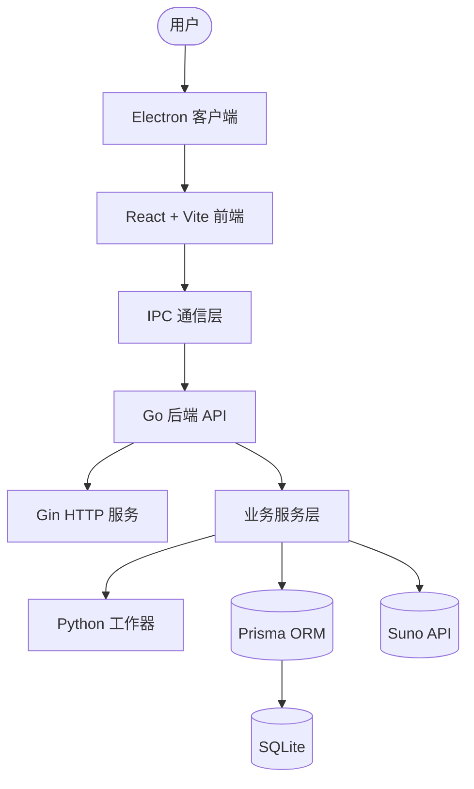

# ROADMAP - 技术路线图

## 概述

此文件夹包含 Moodify 项目的组件依赖图、技术演进路线和里程碑规划。

## 目录结构

```
AIP_Protocol/1_roadmap/
├── README.md                    # 本文件
├── INDEX.md                    # 路线索引
├── components/                 # 组件定义
│   ├── frontend.md            # 前端组件
│   ├── backend.md             # 后端组件
│   └── external.md            # 外部依赖
├── evolution/                 # 演进路线
│   ├── monthly/               # 月度里程碑
│   └── weekly/                # 周任务
└── diagrams/                  # 架构图
    ├── architecture.mmd       # Mermaid 架构图
    └── dataflow.mmd           # 数据流图
```

## 组件依赖总览



## 快速导航

- [组件定义](./components/)
- [演进路线](./evolution/)

## 更新记录

| 日期 | 内容 | 负责人 |
|------|------|--------|
| 2026-04-13 | 创建技术路线图 | AI Assistant |
| 2026-04-14 | 迁移到 AIP_Protocol/1_roadmap/ | AI Assistant |
