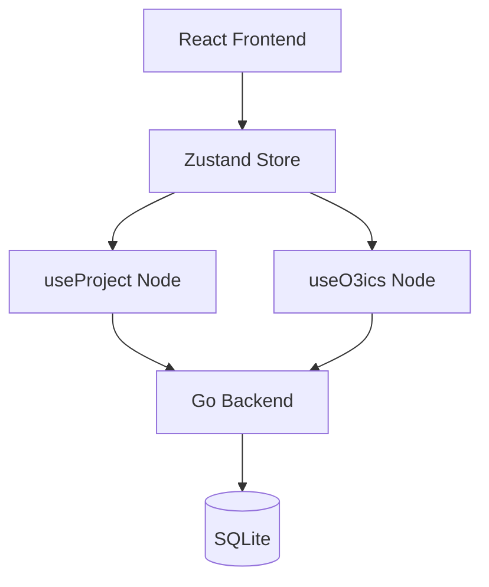

# Month 1: 基础骨架 - 详细执行计划

> **时间**: 2026-04-13 ～ 2026-05-13
> **主题**: 协议核心 + 工具链就绪
> **目标**: 让 AIP 协议能独立运行，完成 Moodify 决策迁移

---

## 📅 月度日程表

```
Week 1 (4/13 - 4/19): 决策迁移
Week 2 (4/20 - 4/26): 路线图迁移
Week 3 (4/27 - 5/3): 任务迁移
Week 4 (5/4  - 5/10): 工具完善 + 试点运行
Buffer (5/11 - 5/13): 缓冲与总结
```

---

## 📋 Week 1: 决策迁移（4/13 - 4/19）

### 目标
将 `decisions/` 目录下的 9 个决策文档迁移到 `AIP_Protocol/0_决策/`，并标准化格式。

### 每日计划

#### Day 1-2: 分析与设计

**任务**：
- [ ] M01-W1-D1: 阅读所有现有决策文档，理解内容
- [ ] M01-W1-D2: 设计标准化 ADR 模板（基于 Michael Nygard 的 ADR 标准）

**产出**：
- `decisions/README.md` 分析报告
- `templates/adr-template.md` 决策模板

**验收**：
- ✅ 模板包含：标题、状态、上下文、决策、后果、替代方案
- ✅ 符合 ADR 最佳实践

---

#### Day 3-4: 批量迁移

**任务**：
- [ ] M01-W1-D3: 迁移 D000-D004（核心愿景、技术栈、架构、数据、部署）
- [ ] M01-W1-D4: 迁移 D005-D008（演进计划、NodeNet、分形、NodeSplit）

**产出**：
- `0_决策/D000-core-vision.md` ~ `D008-nodesplit-rules.md`

**迁移规则**：
```
1. 标题格式：ADR-001: Title → D000-core-vision.md
2. 状态字段：添加 "status: approved"
3. 日期标准化：使用 ISO 8601
4. 标签添加：添加 tech_node 标签（backend/frontend/architecture）
```

**验收**：
- ✅ 9 个决策全部迁移完成
- ✅ 格式统一
- ✅ 无语法错误

---

#### Day 5-7: 索引与验证

**任务**：
- [ ] M01-W1-D5: 实现决策索引生成工具
- [ ] M01-W1-D6: 运行验证，修复格式问题
- [ ] M01-W1-D7: 编写决策系统使用指南

**产出**：
- `tools/update-decision-index.js`（已存在，增强）
- `0_决策/INDEX.md`（自动生成）
- `docs/decision-system-guide.md`

**验收**：
- ✅ `node tools/update-decision-index.js` 成功生成 INDEX
- ✅ INDEX 包含所有决策的链接和状态
- ✅ 决策系统指南清晰易懂

---

### 本周成功标准

- [x] 9 个决策文档全部迁移到 `0_决策/`
- [x] 决策索引自动生成
- [x] 格式验证工具通过
- [x] 编写决策系统指南

---

## 📋 Week 2: 路线图迁移（4/20 - 4/26）

### 目标
将 `roadmap/` 迁移到 `AIP_Protocol/1_roadmap/`，标准化组件定义，绘制架构图。

### 每日计划

#### Day 1-2: 组件定义迁移

**任务**：
- [ ] M01-W2-D1: 迁移 `roadmap/components/definition.yaml`
- [ ] M01-W2-D2: 标准化组件字段（name, description, layer, dependencies）

**产出**：
- `1_roadmap/components/definition.yaml`

**标准化**：
```yaml
# 迁移前
component: App
description: React 应用

# 迁移后
id: "C001"
name: "App"
type: "frontend"
layer: "L1"
description: "React 主应用入口"
dependencies:
  - "C002"  # Sidebar
  - "C003"  # MainContent
status: "completed"
```

**验收**：
- ✅ 所有组件有唯一 ID
- ✅ 依赖关系清晰
- ✅ 层次结构合理（L1/L2/L3）

---

#### Day 3-4: 演进路线迁移

**任务**：
- [ ] M01-W2-D3: 迁移 `roadmap/evolution/` 所有月度计划
- [ ] M01-W2-D4: 统一里程碑格式（M01-M12）

**产出**：
- `1_roadmap/evolution/M01-核心框���.md`
- `1_roadmap/evolution/M02-创作流程.md`
- ...
- `1_roadmap/evolution/M12-年度总结.md`

**格式统一**：
```markdown
# M01: 核心框架

## 目标
- [ ] 任务1
- [ ] 任务2

## 验收标准
- [ ] 标准1
- [ ] 标准2

## 完成日期
- 计划: 2026-04-13
- 实际: TBD
```

---

#### Day 5-7: 架构图绘制

**任务**：
- [ ] M01-W2-D5: 使用 Mermaid 绘制系统架构图
- [ ] M01-W2-D6: 绘制数据流图
- [ ] M01-W2-D7: 绘制组件依赖图

**产出**：
- `1_roadmap/components/architecture.mmd`
- `1_roadmap/components/dataflow.mmd`
- `1_roadmap/components/dependencies.mmd`

**架构图示例**：


**验收**：
- ✅ 架构图清晰展示 L1/L2/L3 三层
- ✅ 数据流图显示请求路径
- ✅ 依赖图无循环依赖

---

### 本周成功标准

- [x] 所有路线图文件迁移完成
- [x] 组件定义标准化（ID、依赖、层次）
- [x] 架构图绘制完成
- [x] 演进路线可视化

---

## 📋 Week 3: 任务迁移（4/27 - 5/3）

### 目标
将 `tasks/` 迁移到 `AIP_Protocol/2_任务/`，统一任务格式，验证依赖关系。

### 每日计划

#### Day 1-2: 任务文件分析

**任务**：
- [ ] M01-W3-D1: 分析现有 tasks/ 目录结构
- [ ] M01-W3-D2: 设计任务迁移映射表

**分析内容**：
```
现有 tasks/ 结构：
├── phase1/
│   ├── 01-项目初始化.md
│   ├── 02-核心框架搭建.md
│   └── ...
├── phase2/
├── phase3/
└── logs/

问题：
- Markdown 格式，非 JSON
- 缺少 task_id
- 没有状态字段
- 依赖关系不明确

迁移策略：
1. 将每个 phase 的 .md 拆分为多个原子任务
2. 生成唯一 task_id（T20260413_XXX）
3. 推断状态（已完成 → completed）
4. 提取依赖关系（从前置任务推断）
```

**产出**：
- `tools/migrate-tasks.js` - 迁移脚本
- `tasks/migration-plan.md` - 迁移计划

---

#### Day 3-5: 批量迁移

**任务**：
- [ ] M01-W3-D3: 迁移 phase1 的 7 个任务 → 14 个原子任务
- [ ] M01-W3-D4: 迁移 phase2-5 的任务
- [ ] M01-W3-D5: 验证任务依赖关系

**迁移示例**：
```markdown
# 原始文件：tasks/phase1/01-项目初始化.md

## 1. 项目目录结构创建
- [x] 已完成

## 2. Go + Python 项目配置
- [x] 已完成

# 迁移后：
2_任务/T20260413_101_项目目录结构创建.json
2_任务/T20260413_102_Go+Python项目配置.json
```

**任务 ID 分配规则**：
```
T20260413_001-099   # AIP 协议自身任务
T20260413_100-199  # Moodify Phase 1 任务
T20260413_200-299  # Moodify Phase 2 任务
T20260413_300-399  # Moodify Phase 3 任务
...
```

---

#### Day 6-7: 验证与完善

**任务**：
- [ ] M01-W3-D6: 运行 `validate-tasks.js` 修复错误
- [ ] M01-W3-D7: 更新仪表盘，检查统计

**产出**：
- `2_任务/` 包含 50+ 个任务文件
- `3_共享/dashboard.md` 显示正确统计

**验证命令**：
```bash
node tools/validate-tasks.js        # 应该 0 错误
node tools/update-dashboard.js      # 仪表盘更新
cat 3_共享/dashboard.md             # 查看统计
```

**验收**：
- ✅ 所有任务格式正确
- ✅ 依赖关系无循环
- ✅ 仪表盘统计准确

---

### 本周成功标准

- [x] 迁移 50+ 个历史任务
- [x] 任务格式 100% 符合 Schema
- [x] 依赖关系正确
- [x] 仪表盘能正确显示

---

## 📋 Week 4: 工具完善 + 试点（4/4 - 5/10）

### 目标
完善工具链，在 Moodify 项目中试点运行 AIP 协议 1 周。

### 每日计划

#### Day 1-2: Git Hooks 集成

**任务**：
- [ ] M01-W4-D1: 创建 pre-commit hook（运行 validate-tasks）
- [ ] M01-W4-D2: 创建 commit-msg hook（自动更新决策索引）

**产出**：
- `.git/hooks/pre-commit`
- `.git/hooks/commit-msg`

**pre-commit 内容**：
```bash
#!/bin/sh
# 提交前验证任务文件
node AIP_Protocol/tools/validate-tasks.js
if [ $? -ne 0 ]; then
  echo "❌ 任务验证失败，请修复"
  exit 1
fi
```

**commit-msg 内容**：
```bash
#!/bin/sh
# 自动更新决策索引
node AIP_Protocol/tools/update-decision-index.js
```

**验收**：
- ✅ `git commit` 自动触发验证
- ✅ 验证失败阻止提交
- ✅ 提交后自动更新索引

---

#### Day 3-4: 用户文档编写

**任务**：
- [ ] M01-W4-D3: 编写《AIP 协议快速开始指南》
- [ ] M01-W4-D4: 编写《常见问题 FAQ》

**产出**：
- `AIP_Protocol/QUICKSTART.md`
- `AIP_Protocol/FAQ.md`

**内容要点**：
- 5 分钟上手 AIP 协议
- 常用命令速查
- 典型问题（任务阻塞、依赖冲突、钩子失败）

---

#### Day 5-7: 试点运行

**任务**：
- [ ] M01-W4-D5: 选择一个小功能，用 AIP 协议管理全流程
- [ ] M01-W4-D6: 记录使用体验，收集问题
- [ ] M01-W4-D7: 编写《 Month 1 总结报告》

**试点任务示例**：
```
T20260413_501: 实现项目删除确认对话框
- 前端: 添加确认弹窗
- 后端: 实现 DELETE /projects/:id
- 测试: 添加删除功能测试
```

**试点流程**：
```
1. 创建任务文件
2. 执行开发
3. 运行钩子
4. 更新状态
5. 提交 Git
6. 记录耗时
```

**数据收集**：
- 每个步骤耗时
- 遇到的阻塞
- 工具是否帮助
- 建议改进点

---

### 本周成功标准

- [x] Git Hooks 正常工作
- [x] 用户文档完善
- [x] 完成 1 个试点任务
- [x] 收集 5+ 条改进建议

---

## 📊 Month 1 验收清单

### 代码质量

- [ ] 所有任务文件通过 `validate-tasks.js`
- [ ] 无 JSON 语法错误
- [ ] 任务 ID 格式统一
- [ ] 依赖关系无循环

### 文档质量

- [ ] 决策系统指南清晰
- [ ] 路线图结构明确
- [ ] 任务系统说明完整
- [ ] 快速开始指南可用

### 工具质量

- [ ] `validate-tasks.js` 能发现所有错误
- [ ] `update-dashboard.js` 生成正确仪表盘
- [ ] Git Hooks 正常工作
- [ ] 命令行工具易用

### 试点反馈

- [ ] 完成至少 1 个端到端任务
- [ ] 记录使用体验
- [ ] 提出 3+ 条改进建议
- [ ] 团队其他成员能理解

---

## 🎯 Month 1 关键指标

| 指标 | 目标值 | 测量方法 |
|------|--------|----------|
| 决策迁移率 | 100% (9/9) | 检查 `0_决策/` 文件数 |
| 任务迁移率 | ≥ 50 个 | 检查 `2_任务/` 文件数 |
| 格式正确率 | 100% | `validate-tasks.js` 输出 |
| 文档完整度 | ≥ 80% | 检查 README 覆盖 |
| 试点成功率 | 100% | 试点任务完成 |

---

## 🚀 Month 2 预告

**主题**：决策增强

**核心目标**：
- 实现决策模板（ADR 标准）
- 添加决策影响分析
- 创建决策自动生成工具

**关键产出**：
- `templates/adr-template.md`
- `tools/analyze-decision-impact.js`
- `tools/generate-decision-from-task.js`
- 所有历史决策升级为 ADR 格式

---

## 📝 每日站会模板

```markdown
# 每日站会 - YYYY-MM-DD

## 昨天完成了什么？
- [ ] 任务1
- [ ] 任务2

## 今天计划做什么？
- [ ] 任务3
- [ ] 任务4

## 更新了哪些决策/任务？
- 创建了 T20260413_XXX
- 更新了 T20260413_YYY 状态

## 遇到什么阻塞？
- 无 / 有（描述）

## 明日预测
- 预计完成 3 个任务
```

---

## 🔄 每周回顾模板

```markdown
# Week X 回顾 - YYYY-MM-DD

## 本周完成
- 迁移了 9 个决策
- 编写了 3 个工具
- 完成了试点任务

## 数据统计
- 完成任务数: 10
- 创建任务数: 15
- 代码修改行数: 500
- 文档字数: 3000

## 遇到的问题
1. 问题1 → 解决方案
2. 问题2 → 待办

## 改进建议
1. 建议1
2. 建议2

## 下周计划
- [ ] 任务1
- [ ] 任务2
```

---

## 🎉 Month 1 成功标志

当你能自信地说：
> ✅ **"AIP 协议已经能完整管理 Moodify 项目的开发了，我们接下来可以只用 AIP 协议工作一年。"**

这意味着 Month 1 成功！

---

*文档版本：1.0.0*  
*最后更新：2026-04-13*  
*下次更新：Month 2 开始前*
