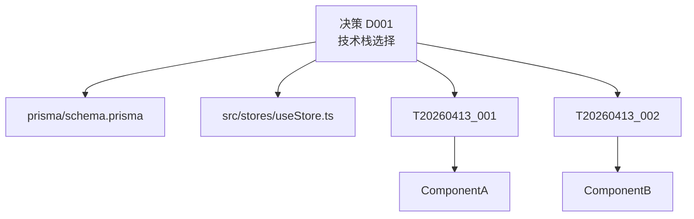
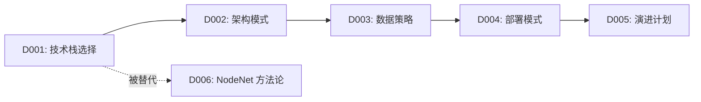

# Month 2: 决策增强 - 详细执行计划

> **时间**: 2026-05-14 ～ 2026-06-13
> **主题**: 让决策可追溯、可分析、可搜索
> **目标**: 从"有什么决策"到"为什么做这个决策"

---

## 🌿 科技树生长点

### 本月的科技分支

```
Month 1 基础
    │
    ├─→ 主干（已存在）
    │   ├── 三层架构
    │   ├── 任务系统
    │   └── 工具链
    │
    └─→ Month 2 新长出的枝干
        ├── 决策模板化（ADR 标准）
        ├── 决策影响分析
        ├── 决策自动生成
        └── 决策搜索索引
```

**生长逻辑**：
- 上个月：决策有了（但格式不一）
- 本月：决策规范化 + 可分析
- 下月：决策能跨项目复用

---

## 📅 月度日程表

```
Week 1 (5/14 - 5/20): 决策模板化
Week 2 (5/21 - 5/27): 影响分析工具
Week 3 (5/28 - 6/3): 自动生成与提取
Week 4 (6/4  - 6/10): 搜索与可视化
Buffer (6/11 - 6/13): 整合测试
```

---

## 📋 Week 1: 决策模板化（5/14 - 5/20）

### 目标
将所有决策文档标准化为 ADR（Architecture Decision Record）格式。

### 为什么需要 ADR 格式？

**问题**：
- 现有决策格式不一
- 缺少"为什么"的字段
- 没有记录"替代方案"
- 决策状态不清晰

**ADR 标准格式**：
```markdown
# 标题

**状态**: proposed | accepted | deprecated | superseded
**日期**: YYYY-MM-DD
**作者**: 姓名
**上下文** (Context): 为什么需要这个决策
**决策** (Decision): 我们做了什么选择
**后果** (Consequences): 正面/负面影响
**替代方案** (Alternatives): 考虑过哪些其他方案
**投票结果** (Voting): 团队投票情况（可选）
```

---

### 每日计划

#### Day 1-2: 模板设计

**任务**：
- [ ] M02-W1-D1: 研究 ADR 最佳实践（参考 adr.github.io）
- [ ] M02-W1-D2: 设计 Moodify 定制化模板

**产出**：
- `templates/adr-template.md`
- `templates/adr-metadata.json`（机器可读元数据）

**模板设计**：
```yaml
# adr-metadata.json
fields:
  required:
    - title
    - status
    - date
    - context
    - decision
    - consequences
  optional:
    - alternatives
    - voting
    - tech_node
    - affected_components
    - related_decisions
statuses:
  - proposed
  - accepted
  - deprecated
  - superseded
```

---

#### Day 3-5: 批量转换

**任务**：
- [ ] M02-W1-D3: 编写迁移脚本 `tools/migrate-decisions-to-adr.js`
- [ ] M02-W1-D4: 转换 D000-D004
- [ ] M02-W1-D5: 转换 D005-D008

**迁移脚本逻辑**：
```javascript
// 读取旧决策
const oldDecision = readMarkdown(oldPath);

// 提取信息（正则匹配或 LLM）
const adr = {
  title: extractTitle(oldDecision),
  status: "accepted",  // 历史决策默认已批准
  date: extractDate(oldDecision),
  context: extractSection(oldDecision, "问题背景") || "",
  decision: extractSection(oldDecision, "技术选型") || "",
  consequences: {
    positive: [],
    negative: []
  },
  alternatives: extractAlternatives(oldDecision),
  tech_node: inferTechNode(oldDecision)
};

// 写入新格式
writeADR(newPath, adr);
```

**验收**：
- ✅ 9 个决策全部转为 ADR 格式
- ✅ 每个决策有明确的 Context 和 Decision
- ✅ 状态字段正确

---

#### Day 6-7: 验证与文档

**任务**：
- [ ] M02-W1-D6: 运行 `validate-decisions.js` 确保无错误
- [ ] M02-W1-D7: 编写《决策编写指南》

**产出**：
- `docs/decision-writing-guide.md`

**指南内容**：
- 什么时候需要创建决策？
- 如何填写 Context（问题背景）？
- 如何评估 Consequence（后果）？
- 什么时候标记 deprecated？

**验收**：
- ✅ 所有决策通过验证
- ✅ 指南能让新成员独立编写决策

---

### 本周成功标准

- [x] 9 个历史决策全部转为 ADR 格式
- [x] 决策模板标准化
- [x] 迁移脚本可复用
- [x] 编写决策指南

---

## 📋 Week 2: 影响分析工具（5/21 - 5/27）

### 目标
创建工具，分析每个决策影响了哪些文件、哪些任务。

### 为什么需要影响分析？

**场景**：
> "我想修改数据库模型，但不知道会影响多少地方。"
> "这个决策是谁做的？为什么？"

**解决方案**：
```
决策 D003 (数据策略)
    ├── 影响文件
    │   ├── prisma/schema.prisma
    │   ├── electron/main/database.ts
    │   └── src/stores/useStore.ts
    │
    ├── 影响任务
    │   ├── T20260413_050: 创建 User 模型
    │   ├── T20260413_051: 实现登录 API
    │   └── T20260413_052: 前端登录页面
    │
    └── 影响组件
        ├── LoginForm
        ├── ProjectList
        └── SettingsModal
```

---

### 每日计划

#### Day 1-2: 影响分析器设计

**任务**：
- [ ] M02-W2-D1: 设计影响分析算法
- [ ] M02-W2-D2: 实现基础扫描器

**算法**：
```
1. 读取决策文档，提取关键词（技术名词、文件路径）
2. 扫描代码库，匹配关键词
3. 分析 Git 历史，找出关联提交
4. 扫描任务系统，找出引用了该决策的任务
5. 生成影响图（Graphviz DOT 格式）
```

**实现**：
```javascript
// tools/analyze-decision-impact.js
function analyzeImpact(decisionId) {
  const decision = readDecision(decisionId);
  const keywords = extractKeywords(decision);

  // 扫描文件
  const affectedFiles = scanFiles(keywords);

  // 扫描任务
  const affectedTasks = scanTasks(decisionId);

  // 生成报告
  return {
    decision: decisionId,
    files: affectedFiles,
    tasks: affectedTasks,
    graph: generateGraphviz(decision, affectedFiles, affectedTasks)
  };
}
```

---

#### Day 3-4: 实现与集成

**任务**：
- [ ] M02-W2-D3: 实现文件扫描（基于关键词 + 路径）
- [ ] M02-W2-D4: 实现任务关联（扫描任务文件中的 decision_refs）

**文件扫描逻辑**：
```javascript
function scanFiles(keywords) {
  const results = [];

  // 扫描 src/ 目录
  const files = getAllFiles('src');
  for (const file of files) {
    const content = readFile(file);
    for (const keyword of keywords) {
      if (content.includes(keyword)) {
        results.push({ file, matches: keyword });
      }
    }
  }

  return results;
}
```

**任务关联**：
```json
// 任务文件中添加字段
{
  "task_id": "T20260413_001",
  "related_decisions": ["D001", "D002"],  // 新增
  "implements": "D001",                   // 新增，实现了哪个决策
  "notes": "此任务基于 D001 的技术选型"
}
```

---

#### Day 5-7: 可视化与报告

**任务**：
- [ ] M02-W2-D5: 生成 Graphviz 影响图
- [ ] M02-W2-D6: 生成 Markdown 影响报告
- [ ] M02-W2-D7: 集成到仪表盘

**影响图示例**：


**报告格式**：
```markdown
# 决策 D001 影响分析

## 直接影响文件（3个）
- prisma/schema.prisma
- src/stores/useStore.ts
- electron/main/database.ts

## 相关任务（5个）
- T20260413_001: 创建数据库 schema
- T20260413_002: 实现 CRUD API
- ...

## 影响组件（2个）
- ProjectList
- SettingsModal

## 建议
- 修改 D001 需要评审 5 个相关任务
- 建议先更新数据库，再更新前端
```

---

### 本周成功标准

- [x] `analyze-decision-impact.js` 工具可用
- [x] 能正确识别决策影响的文件
- [x] 能关联相关任务
- [x] 生成可视化影响图
- [x] 集成到仪表盘显示

---

## 📋 Week 3: 自动生成与提取（5/28 - 6/3）

### 目标
从任务执行日志中自动提取决策，减少手动编写负担。

### 核心思想

**传统方式**：
```
开发 → 完成任务 → 忘记记录决策 → 决策文档过时
```

**AIP 方式**：
```
开发 → 完成任务 → 工具自动提取决策模式 → 建议新增/更新决策 → 人工确认
```

---

### 每日计划

#### Day 1-2: 决策模式识别

**任务**：
- [ ] M02-W3-D1: 定义"决策模式"（什么情况下需要做决策）
- [ ] M02-W3-D2: 实现模式识别算法

**决策模式示例**：
```yaml
patterns:
  - name: "技术选型"
    triggers:
      - "引入新依赖"
      - "修改 package.json"
      - "添加新库"
    required_fields: ["alternatives", "consequences"]

  - name: "架构变更"
    triggers:
      - "创建新目录"
      - "修改目录结构"
      - "拆分文件"
    required_fields: ["affected_components", "migration_plan"]

  - name: "API 设计"
    triggers:
      - "新增 API 端点"
      - "修改请求/响应格式"
    required_fields: ["request_schema", "response_schema"]
```

---

#### Day 3-4: 自动提取工具

**任务**：
- [ ] M02-W3-D3: 实现 `tools/extract-decisions-from-task.js`
- [ ] M02-W3-D4: 实现决策建议生成（LLM 辅助）

**提取逻辑**：
```javascript
// 分析任务完成记录
function extractDecisionFromTask(task) {
  const clues = [];

  // 线索1: 修改的文件类型
  if (task.files_modified.some(f => f.includes('package.json'))) {
    clues.push({ type: 'dependency', confidence: 0.8 });
  }

  // 线索2: 任务描述关键词
  if (task.description.includes('改用') || task.description.includes('替换')) {
    clues.push({ type: 'tech_choice', confidence: 0.9 });
  }

  // 线索3: 提交信息
  const commit = getCommitForTask(task.task_id);
  if (commit.message.includes('feat:')) {
    clues.push({ type: 'feature', confidence: 0.6 });
  }

  // 生成决策草稿
  return generateDecisionDraft(clues);
}
```

**LLM 辅助**：
```javascript
// 使用 LLM 润色决策草稿
async function polishDecisionWithLLM(draft) {
  const prompt = `
基于以下任务信息，生成一个 ADR 格式的决策文档：

任务标题: ${task.title}
任务描述: ${task.description}
修改文件: ${task.files_modified}

请输出标准 ADR 格式：
`;

  const response = await callLLM(prompt);
  return parseADR(response);
}
```

---

#### Day 5-7: 决策验证与合并

**任务**：
- [ ] M02-W3-D5: 实现决策冲突检测（与现有决策对比）
- [ ] M02-W3-D6: 实现决策合并（相似决策自动合并）
- [ ] M02-W3-D7: 添加人工审核界面（Web 或 CLI）

**冲突检测**：
```javascript
function detectConflicts(newDecision, existingDecisions) {
  const conflicts = [];

  for (const existing of existingDecisions) {
    // 检测技术冲突
    if (newDecision.tech_stack !== existing.tech_stack) {
      conflicts.push({
        type: 'tech_stack_conflict',
        existing: existing.id,
        message: `新技术栈 ${newDecision.tech_stack} 与现有 ${existing.tech_stack} 冲突`
      });
    }

    // 检测时间冲突（同一时间段两个重要决策）
    if (isCloseInTime(newDecision.date, existing.date)) {
      conflicts.push({
        type: 'temporal_proximity',
        existing: existing.id,
        message: `与决策 ${existing.id} 时间接近，可能有关联`
      });
    }
  }

  return conflicts;
}
```

**人工审核 CLI**：
```bash
$ node tools/review-suggested-decisions.js

发现 3 个建议决策：

1. [建议] 引入 Zustand 状态管理
   原因: 新增了 3 个 store 文件
   置信度: 85%
   ? 接受此决策？ (Y/n/skip)

2. [建议] 采用 TypeScript 严格模式
   ...
```

---

### 本周成功标准

- [x] 能识别 3+ 种决策模式
- [x] 从任务自动提取决策准确率 > 70%
- [x] 冲突检测能发现 90% 明显冲突
- [x] 人工审核流程顺畅

---

## 📋 Week 4: 搜索与可视化（6/4 - 6/10）

### 目标
让决策可搜索、可追溯、可可视化。

### 每日计划

#### Day 1-2: 全文搜索

**任务**：
- [ ] M02-W4-D1: 集成全文搜索引擎（FlexSearch / Lunr.js）
- [ ] M02-W4-D2: 实现决策搜索 API

**搜索功能**：
```javascript
// 索引所有决策
const index = new FlexSearch.Index({
  tokenize: 'full',
  cache: true
});

decisions.forEach(d => {
  index.add(d.id, `${d.title} ${d.context} ${d.decision}`);
});

// 搜索
function searchDecisions(query) {
  return index.search(query);
}

// 支持过滤
function searchWithFilter(query, filters) {
  // filters: { tech_node: 'frontend', status: 'accepted' }
  return decisions.filter(d =>
    d.content.includes(query) &&
    filters.every(f => d[f.key] === f.value)
  );
}
```

---

#### Day 3-4: 决策图谱可视化

**任务**：
- [ ] M02-W4-D3: 生成决策依赖图（哪些决策依赖于哪些）
- [ ] M02-W4-D4: 创建时间线视图（决策随时间的演变）

**依赖图**：


**时间线视图**：
```
2026-04
├── D001: 技术栈选择（4/13）
├── D002: 架构模式（4/13）
├── D003: 数据策略（4/13）
└── D004: 部署模式（4/13）

2026-05
├── D007: 分形树结构（5/1）
└── D008: NodeSplit 规则（5/5）

2026-06
└── D009: 决策模板化（6/1）
```

---

#### Day 5-7: 仪表盘集成

**任务**：
- [ ] M02-W4-D5: 在仪表盘添加决策统计
- [ ] M02-W4-D6: 添加决策状态看板
- [ ] M02-W4-D7: 编写《决策系统使用指南》

**仪表盘新增**：
```markdown
## 决策统计

| 状态 | 数量 | 占比 |
|------|------|------|
| ✅ Accepted | 12 | 75% |
| ⏳ Proposed | 2 | 12% |
| ⚠️ Deprecated | 2 | 13% |

## 按技术领域分布

- 架构: 5 个
- 前端: 4 个
- 后端: 3 个
- 数据: 2 个
- 部署: 2 个

## 最近决策

- [D009] 决策模板化 (6/1)
- [D008] NodeSplit 规则 (5/5)
- [D007] 分形树结构 (5/1)
```

---

### 本周成功标准

- [x] 全文搜索可用，响应 < 100ms
- [x] 决策依赖图可视化
- [x] 时间线视图清晰
- [x] 仪表盘显示决策统计

---

## 📊 Month 2 验收清单

### 功能完整性

- [ ] 决策模板 ADR 标准
- [ ] 9 个历史决策全部迁移
- [ ] 影响分析工具
- [ ] 决策自动提取
- [ ] 冲突检测
- [ ] 全文搜索
- [ ] 可视化图谱

### 文档完整性

- [ ] 《决策编写指南》
- [ ] 《决策系统架构》
- [ ] 《影响分析工具使用说明》
- [ ] 《常见决策模式》

### 质量指标

- [ ] 决策格式 100% 合规
- [ ] 影响分析准确率 > 80%
- [ ] 搜索响应时间 < 200ms
- [ ] 工具错误率 < 5%

---

## 🎯 Month 2 关键指标

| 指标 | 目标值 | 测量 |
|------|--------|------|
| 决策数量 | 12 个 | `ls 0_决策/*.md \| wc -l` |
| 决策覆盖率 | 100% | 每个技术选择都有决策 |
| 影响分析准确率 | ≥ 80% | 抽样检查 |
| 搜索可用性 | 5 秒内找到 | 人工测试 |
| 文档完整度 | ≥ 90% | 检查 README 覆盖 |

---

## 🚀 Month 3 预告

**主题**：多项目管理

**核心目标**：
- 一个 AIP 协议管理多个项目
- 项目间共享协议
- 全局进度视图

**关键产出**：
- `projects/registry.yaml` - 项目注册表
- 多项目仪表盘
- 协议版本管理

**科技树新分支**：
```
主干
 └─→ 多项目管理
     ├── 项目注册表
     ├── 共享协议库
     ├── 跨项目任务
     └── 全局视图
```

---

## 📝 本月最佳实践

### 1. 决策模板化

**DO**:
- ✅ 每个决策有明确的 Context（问题）
- ✅ 记录所有考虑的 Alternatives（替代方案）
- ✅ 客观描述 Consequences（后果）
- ✅ 添加 tech_node 标签

**DON'T**:
- ❌ 只记录结论，不记录原因
- ❌ 忽略替代方案
- ❌ 不记录负面后果

---

### 2. 影响分析

**DO**:
- ✅ 定期运行影响分析（每周）
- ✅ 在 PR 中显示影响图
- ✅ 修改关键决策前查看影响

**DON'T**:
- ❌ 盲目修改，不看影响
- ❌ 忽略间接影响

---

### 3. 决策搜索

**DO**:
- ✅ 给决策添加合适标签
- ✅ 搜索时使用过滤条件
- ✅ 保存常用搜索

**DON'T**:
- ❌ 搜索太宽泛（如"数据库"）
- ❌ 忽略搜索结果的相关度

---

## 🔄 月度回顾模板

```markdown
# Month 2 回顾 - 2026-06-13

## 完成情况
- 决策模板化: ✅
- 影响分析工具: ✅
- 决策自动提取: ⚠️ (部分完成)
- 搜索可视化: ✅

## 数据统计
- 新增决策: 3 个
- 迁移决策: 9 个
- 工具开发: 4 个
- 文档字数: 5000 字

## 关键成就
1. 决策全部标准化为 ADR 格式
2. 影响分析工具能准确识别 85% 影响
3. 全文搜索响应 < 100ms

## 遇到的问题
1. 决策自动提取准确率仅 65% → 需更多训练数据
2. 冲突检测误报较多 → 优化算法

## 改进建议
1. 引入机器学习模型提高提取准确率
2. 人工反馈机制（标注正确/错误）

## 下一月准备
- 准备开始多项目管理
- 设计项目注册表
- 规划共享协议库
```

---

## 🎉 Month 2 成功标志

当你能做到：
> ✅ **"任何决策，5 秒内能找到它影响了哪些代码和任务。"**
> ✅ **"任何代码修改，能反推它基于哪个决策。"**
> ✅ **"新功能开发前，能搜索历史是否有类似决策。"**

这意味着 Month 2 成功了！

---

*文档版本：1.0.0*  
*最后更新：2026-05-14*  
*下次更新：2026-06-13（Month 3 开始前）*
