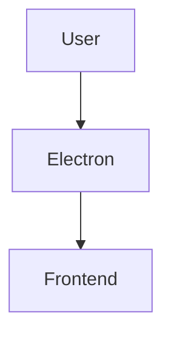

# AIP 协议使用指南完整版

> **版本**: 1.0.0  
> **创建日期**: 2026-04-13  
> **最后更新**: 2026-04-14

---

## 📖 目录

1. [什么是 AIP 协议](#什么是-aip-协议)
2. [核心概念](#核心概念)
3. [快速开始](#快速开始)
4. [决策系统](#决策系统)
5. [路线图系统](#路线图系统)
6. [任务系统](#任务系统)
7. [工具使用](#工具使用)
8. [Git Hooks](#git-hooks)
9. [最佳实践](#最佳实践)
10. [常见问题](#常见问题)

---

## 什么是 AIP 协议

### 定义

**AIP 协议**（Architecture & Iteration Protocol）是一个专为 Moodify 项目设计的**架构演化协议**。它帮助你：

- 📋 **追踪决策**：记录"为什么做这个技术选择"
- 🗺️ **规划演进**：清晰的月度里程碑和迭代节奏
- 🎯 **任务管理**：结构化、可追踪的任务系统
- 🔧 **工具化**：自动化验证、索引、报告
- 🌱 **持续进化**：软件像活系统一样生长

### 核心理念

> "让 AI 改逻辑，不让 AI 改结构"

Moodify 采用 **NodeNet 三层架构**：

| 层级 | 状态 | 位置 | 说明 |
|------|------|------|------|
| L1 结构层 | 🔒 锁定 | `src/components/` | 组件的 JSX 结构，不可改 |
| L2 逻辑层 | ✏️ 可改 | `src/hooks/`, `src/stores/` | 业务逻辑，只改逻辑 |
| L3 配置层 | ⚙️ 驱动 | `ports.json`, `.nodesplit.json` | 流程配置，JSON 驱动 |

---

## 核心概念

### 1. 决策 (Decision)

每个决策回答一个问题："为什么选择 A 而不是 B？"

#### 决策文档结构

```markdown
# D001: 技术栈选择

> **ID**: D001
> **状态**: approved
> **日期**: 2026-04-13
> **版本**: 1.0.0

## 决策内容

### 前端技术栈
| 层级 | 技术 | 版本 | 理由 |
|------|------|------|------|
| 框架 | React | 18.x | 生态成熟 |

### 约束契约

```yaml
tech_stack:
  frontend:
    react: ">=18.0"
```

## 理由
- 选择 React 的理由...

## 影响范围
- 所有架构决策必须符合...

## 回滚条件
- 如果性能问题无法解决，可考虑迁移到 Tauri

## 修订历史
| 日期 | 版本 | 修改内容 |
```

#### 决策状态

| 状态 | 说明 |
|------|------|
| `proposed` | 提议中，待讨论 |
| `approved` | 已批准，开始实施 |
| `implemented` | 已实施，正在使用 |
| `deprecated` | 已弃用，不再使用 |
| `reverted` | 已回滚，恢复旧方案 |
| `superseded` | 已被新决策替代 |

---

### 2. 路线图 (Roadmap)

路线图定义了项目的**技术演进路线**和**组件依赖关系**。

#### 组件定义 (YAML)

```yaml
component: frontend
path: ./src
interface:
  type: browser_window
port: 5173 (dev) / bundled (prod)
slo:
  fcp_ms: 1500
  tti_ms: 3000
dependencies: [backend_api]
```

#### 架构图 (Mermaid)



---

### 3. 任务 (Task)

任务是具体的、可执行的工作单元。

#### 任务 JSON 格式

```json
{
  "task_id": "T20260413_001",
  "title": "初始化 AIP 协议目录结构",
  "description": "创建 AIP 协议标准目录结构...",
  "type": "feature",
  "tech_node": "R0",
  "priority": "P0",
  "status": "pending",
  "created_at": "2026-04-13T10:00:00Z",
  "completed_at": null,
  "assignee": "AI Assistant",
  "preconditions": [],
  "postconditions": ["T20260413_002"],
  "acceptance_criteria": [
    "AIP_Protocol/ 目录结构完整"
  ],
  "files_modified": [
    "AIP_Protocol/0_决策/README.md"
  ],
  "notes": "已完成目录结构创建"
}
```

#### 任务优先级

| 优先级 | 说明 |
|--------|------|
| P0 | 最高优先级，必须立即执行 |
| P1 | 高优先级，本周完成 |
| P2 | 中优先级，本月完成 |
| P3 | 低优先级，有空再做 |

#### 任务状态

| 状态 | 说明 |
|------|------|
| `pending` | 待处理，未开始 |
| `in_progress` | 进行中 |
| `completed` | 已完成 |
| `blocked` | 被阻塞，需要外部帮助 |
| `cancelled` | 已取消 |

---

## 快速开始

### 第 1 步：查看待执行任务

```bash
# 查看所有待处理任务
cd AIP_Protocol/2_任务
ls *.json | grep '"status": "pending"'
```

### 第 2 步：执行任务

1. **阅读任务描述**

```bash
cat AIP_Protocol/2_任务/T20260413_002.json
```

2. **执行开发工作**

按照 `acceptance_criteria` 逐一完成。

3. **运行验证**

```bash
node AIP_Protocol/tools/validate-tasks.js
node AIP_Protocol/tools/validate-decisions.js
```

4. **更新仪表盘**

```bash
node AIP_Protocol/tools/update-dashboard.js
```

### 第 3 步：记录完成

1. 更新任务状态为 `completed`
2. 填写 `completed_at` 时间戳
3. 在 `notes` 中记录完成情况
4. 运行 Git Hook 自动更新索引

---

## 决策系统

### 创建新决策

1. **确定决策 ID**

```bash
# 查看现有决策，确定下一个 ID
ls AIP_Protocol/0_决策/D*.md
```

2. **创建决策文件**

```bash
# 在 AIP_Protocol/0_决策/ 下创建 Dxxx-标题.md
vim AIP_Protocol/0_决策/D009-xxx.md
```

3. **填写决策内容**

遵循决策模板的结构（ID、状态、日期、标题、决策内容、理由、影响范围、回滚条件、修订历史）。

4. **验证并更新索引**

```bash
node AIP_Protocol/tools/validate-decisions.js
node AIP_Protocol/tools/update-decision-index.js
```

### 迁移现有决策

```bash
# 1. 复制决策文件到 AIP_Protocol/0_决策/
cp decisions/D000-*.md AIP_Protocol/0_决策/

# 2. 更新索引
node AIP_Protocol/tools/update-decision-index.js
```

---

## 路线图系统

### 组件定义

每个组件定义包括：

- `component`: 组件名称
- `path`: 文件路径
- `interface`: 接口类型和端口
- `slo`: 服务等级目标
- `dependencies`: 依赖的其他组件

### 架构图

使用 Mermaid 语法绘制架构图：

````markdown

````

### 演进路线

月度里程碑规划，包含：

- 月度主题
- 关键任务
- 验收标准
- 产出物

---

## 任务系统

### 创建新任务

```json
{
  "task_id": "T20260414_005",
  "title": "任务标题",
  "description": "详细描述",
  "type": "feature|bugfix|refactor",
  "tech_node": "R0",
  "priority": "P0",
  "status": "pending",
  "created_at": "2026-04-14T10:00:00Z",
  "completed_at": null,
  "assignee": "AI Assistant",
  "preconditions": ["T20260413_001"],
  "postconditions": [],
  "acceptance_criteria": [
    "标准1",
    "标准2"
  ],
  "files_modified": [
    "AIP_Protocol/0_决策/README.md"
  ],
  "notes": ""
}
```

#### tech_node 参考

| Node | 说明 |
|------|------|
| R0 | 协议核心层 |
| L1 | UI 结构层 |
| L2 | 逻辑层 |
| L3 | 配置层 |

### 任务依赖

使用 `preconditions` 和 `postconditions` 定义依��关系：

```json
{
  "preconditions": ["T20260413_001", "T20260413_002"],
  "postconditions": ["T20260414_004"]
}
```

---

## 工具使用

### 验证任务

```bash
# 验证所有任务文件格式
node AIP_Protocol/tools/validate-tasks.js

# 输出示例
✅ T20260413_001_初始化AIP协议目录.json (completed)
✅ T20260413_002_创建决策文档系统.json (completed)
```

### 验证决策

```bash
# 验证所有决策文件
node AIP_Protocol/tools/validate-decisions.js

# 输出示例
✅ D000-core-vision.md
✅ D001-tech-stack.md
```

### 更新决策索引

```bash
# 自动扫描 0_决策/ 并生成 INDEX.md
node AIP_Protocol/tools/update-decision-index.js
```

### 更新仪表盘

```bash
# 生成全局进度仪表盘
node AIP_Protocol/tools/update-dashboard.js
```

### 生成周报

```bash
# 生成第 1 周周报，主题为 "M1核心框架"
node AIP_Protocol/tools/weekly-report.js 1 "M1核心框架"
```

---

## Git Hooks

### 自动安装

```bash
# 使用 git config 设置 hooksPath
git config core.hooksPath AIP_Protocol/hooks

# 或手动复制
cp AIP_Protocol/hooks/pre-commit .git/hooks/
cp AIP_Protocol/hooks/commit-msg .git/hooks/
chmod +x .git/hooks/pre-commit .git/hooks/commit-msg
```

### Hooks 执行流程

```
git commit
    ↓
pre-commit hook (验证任务/决策格式)
    ↓
打开编辑器填写 commit message
    ↓
commit-msg hook (自动更新索引和仪表盘)
    ↓
提交完成
```

### 跳过 Hooks

```bash
git commit --no-verify -m "紧急修复"
```

---

## 最佳实践

### 1. 每日工作流程

```
每日开始:
1. 查看待执行任务：ls AIP_Protocol/2_任务/*.json | grep pending
2. 选择优先级最高的任务
3. 阅读任务描述，理解验收标准
4. 执行开发工作
5. 运行验证工具
6. 更新任务状态
7. 提交（Git Hook 会自动更新索引）

每日结束:
1. 运行 weekly-report.js 生成当日日志
2. 更新 event_log.yaml
3. 查看 dashboard.md 了解整体进度
```

### 2. 任务拆分原则

一个任务应该：

- ✅ 明确的可验收标准
- ✅ 工作时长 < 4 小时
- ✅ 只涉及 1-2 个文件修改
- ✅ 单一职责，不耦合其他功能

### 3. NodeNet 架构规则

#### 修改样式 → 改 CSS

```css
/* ✅ 正确 */
.bg-moodify-primary {
    background-color: #6366f1;
}
```

#### 修改逻辑 → 改 Node

```typescript
// ✅ 正确：在 src/hooks/useMoodPlayer.ts 中修改逻辑
export const useMoodPlayer = () => {
    // 业务逻辑在这里
}
```

#### 修改结构 → ❌ 禁止

```tsx
// ❌ 禁止：不要修改组件结构
export const Player = () => {
    return (
        <div>
            {/* 除非用户明确要求，否则不要修改这里的 JSX */}
        </div>
    )
}
```

### 4. 决策记录

每个决策必须回答：

1. **背景**：为什么需要这个决策？
2. **方案**：有哪些选择？
3. **选择**：为什么选这个？
4. **后果**：有什么影响？
5. **回滚**：如果错了怎么退？

### 5. 文档规范

- 使用中文编写（除非技术术语）
- 添加代码示例
- 包含表格和图表
- 记录日期和版本

---

## 常见问题

### Q: 不知道第一个任务做什么？

**A**: 查看 `AIP_Protocol/2_任务/` 中 `status: "pending"` 的第一个任务：

```bash
cat AIP_Protocol/2_任务/*.json | grep '"status": "pending"'
```

### Q: 任务卡住了怎么办？

**A**: 
1. 将任务状态改为 `blocked`
2. 在 `notes` 中记录阻塞原因
3. 记录事件到 `event_log.yaml`
4. 继续下一个任务

### Q: 钩子执行失败？

**A**:
1. 查看错误信息
2. 修复问题（通常是格式���误）
3. 重新执行钩子验证
4. 如果无法修复，使用 `--no-verify` 跳过（需说明原因）

### Q: 如何添加新任务？

**A**:
1. 确定任务 ID（按日期顺序）
2. 创建 JSON 文件在 `AIP_Protocol/2_任务/`
3. 填写完整任务信息
4. 执行任务
5. 更新状态

### Q: 决策和任务的区别？

**A**:
- **决策**：回答"为什么"（技术选型、架构设计）
- **任务**：回答"做什么"（具体实施、开发工作）

### Q: 如何更新仪表盘？

**A**: 每次完成一个任务后：

```bash
node AIP_Protocol/tools/update-dashboard.js
```

### Q: Git Hook 不工作？

**A**:
1. 检查 hooks 文件是否有执行权限：`ls -la .git/hooks/`
2. 确保文件在正确的目录
3. 使用 `git config core.hooksPath AIP_Protocol/hooks` 配置
4. 测试：`git commit --allow-empty -m "test"`

---

## 附录

### AIP 协议目录结构

```
AIP_Protocol/
├── 0_决策/              # 决策文档 (D000-D999)
│   ├── README.md
│   ├── INDEX.md         # 自动生成的索引
│   ├── D000-core-vision.md
│   ├── D001-tech-stack.md
│   └── ...
│
├── 1_roadmap/           # 技术路线图
│   ├── README.md
│   ├── INDEX.md
│   ├── components/      # 组件定义
│   │   ├── definition.yaml
│   │   └── architecture.mmd
���   └── evolution/       # 演进路线
│       ├── M01-核心框架.md
│       └── ...
│
├── 2_任务/              # 任务系统
│   ├── README.md
│   ├── INDEX.md         # 自动生成的任务索引
│   ├── T20260413_001_*.json
│   ├── phase1/          # 阶段任务
│   ├── phase2/
│   └── logs/            # 工作日志
│
├── 3_共享/              # 共享状态
│   ├── README.md
│   ├── HOOKS.yaml       # 自检钩子定义
│   ├── event_log.yaml   # 事件历史
│   └── dashboard.md     # 自动生成的仪表盘
│
├── tools/               # 工具脚本
│   ├── update-decision-index.js
│   ├── validate-decisions.js
│   ├── validate-tasks.js
│   ├── update-dashboard.js
│   ├── weekly-report.js
│   └── README.md
│
└── hooks/               # Git Hooks
    ├── pre-commit
    ├── commit-msg
    └── README.md
```

### 文件命名规范

| 类型 | 格式 | 示例 |
|------|------|------|
| 决策 | `D{三位数}-{描述}.md` | D001-tech-stack.md |
| 任务 | `T{YYYYMMDD}_{三位数}_{描述}.json` | T20260413_001_初始化目录.json |
| 周报 | `{YYYY-MM-DD}-W{周次}-周报.md` | 2026-04-13-W01-周报.md |

---

## 立即开始

### 新手任务清单

- [ ] 阅读本指南（当前）
- [ ] 查看 `AIP_Protocol/0_决策/` 了解现有决策
- [ ] 查看 `AIP_Protocol/2_任务/INDEX.md` 了解任务状态
- [ ] 运行 `node AIP_Protocol/tools/update-dashboard.js` 查看仪表盘
- [ ] 找到第一个待执行任务并开始工作

### 常用命令速查

```bash
# 查看所有待处理任务
cat AIP_Protocol/2_任务/*.json | grep '"status": "pending"'

# 验证工具
node AIP_Protocol/tools/validate-tasks.js
node AIP_Protocol/tools/validate-decisions.js

# 更新索引和仪表盘
node AIP_Protocol/tools/update-decision-index.js
node AIP_Protocol/tools/update-dashboard.js

# 生成周报
node AIP_Protocol/tools/weekly-report.js 1 "M1核心框架"

# 查看事件日志
cat AIP_Protocol/3_共享/event_log.yaml
```

---

**🎉 恭喜！你已经完成了 AIP 协议的基础学习。**

> "让 AIP 协议成为项目进化的'活系统'" 🌱

如有疑问，请查阅 [HOOKS.yaml](3_shared/HOOKS.yaml) 或 [工具 README](tools/README.md)。
